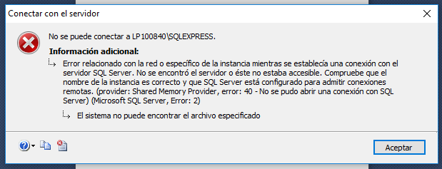

# Introducción a SQL

### 1.	Abrir Microsoft SQL Server
•	En el buscador ingresamos “SQL Server 2014 Management Studio”


•	Verificamos que en la ventana emergente estén seleccionadas las opciones “Motor de base de datos” y “Autenticación de Windows”. No debemos ingresar ni usuario ni clave. Damos click en “Conectar”.


•	Si procedimos de manera correcta, debería verse de la siguiente manera. Si detectamos algún problema, pasar al acápite “En caso de error”, al final de esta sección.


•	De ahora en adelante, cada vez que trabajemos en SQL, debemos abrir el espacio de trabajo “Nueva consulta”. Cuando queramos ejecutar las sentencias, damos click a “Ejecutar”. Nota: Este botón ejecuta todas las sentencias, para ejecutar solo una parte de las sentencias se deberá seleccionar las sentencias debidas.


•	Para guardar las consultas, nos dirigimos a Archivo > Guardar [nombre].sql como…


En caso de error:
•	Puede que se haya procedido de manera correcta y aun así aparezca un mensaje de error como el siguiente.



•	Para solucionarlo, nos dirigimos al Administrador de Tareas (Ctrl+Alt+Supr), vamos a la pestaña “Servicios”, damos click derecho en MSSQL$SQLEXPRESS o el nombre con el que no se pudo ingresar, damos click a “Iniciar”. Una vez que el estado sea “En ejecución”, abrimos de nuevo SQL, siguiendo los pasos anteriores.


```python

```


```python

```
